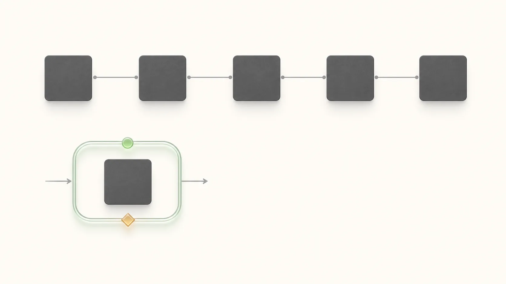

# Expensive Tokens Won't Save Enterprise AI

Enterprise AI has a measurement trap.

Token spend is easy to see. Model access is easy to buy. Usage charts are easy to report. None of that proves the work changed.

That is why the recent AI news has a strange rhythm.

[Anthropic](https://www.anthropic.com/news/enterprise-ai-services-company) formed a new enterprise AI services company with Blackstone, Hellman & Friedman, Goldman Sachs, and other investors. [OpenAI](https://openai.com/index/openai-launches-the-deployment-company/) launched the OpenAI Deployment Company and agreed to acquire Tomoro. [AWS](https://www.aboutamazon.com/news/aws/aws-1-billion-forward-deployed-ai-engineers) committed $1 billion to a Forward Deployed Engineering organization. [Microsoft](https://blogs.microsoft.com/blog/2026/07/02/microsoft-frontier-company-ai-engineering-that-amplifies-and-protects-your-intelligence/) launched Frontier Company with a $2.5 billion investment and 6,000 embedded industry and engineering experts.

Different companies. Different ecosystems. Same move.

If better model access were enough, these announcements would look like cheaper inference, larger context windows, and more generous API tiers. Instead, they look like deployment organizations.

They are all putting engineering talent closer to the customer because enterprise AI has entered a different phase. The first phase was about access to intelligence: models, APIs, copilots, context windows, agents, benchmarks. The next phase is about deployment capability: whether a company can put that intelligence into real workflows without breaking trust, compliance, ownership, or economics.

That is why forward deployed engineering is suddenly visible again.

FDE is the job title. The deeper signal is that enterprise AI is no longer bottlenecked mainly by whether the model can perform a task. The harder question is whether an organization can turn that task into a reliable operating loop.

That question lives far away from a keynote demo. It lives inside data permissions, workflow gaps, legacy systems, security reviews, procurement, audit trails, employee habits, budget owners, and the uncomfortable sentence every enterprise buyer eventually asks:

What changed in the business because of this?

## The Pattern Is Deployment, Not Services

Anthropic's announcement is a clean entry point because it names the market gap directly. The new company is meant to help mid-sized companies bring Claude into core operations. Anthropic points to community banks, mid-sized manufacturers, and regional health systems: serious organizations with real operational complexity, but not always enough internal AI engineering capacity to build frontier deployments alone.

That detail matters. The largest enterprises can hire major systems integrators, build platform teams, and run multi-year transformation programs. The middle of the market still has fragmented data, regulated workflows, expensive manual processes, and pressure to show results. It may have the same AI opportunity with less implementation muscle.

OpenAI's Deployment Company makes the same argument from another angle. OpenAI says its forward deployed engineers will work with business leaders, operators, and frontline teams to identify high-impact workflows, redesign infrastructure around AI, and connect models to customer data, tools, controls, and business processes. It also agreed to acquire Tomoro, bringing roughly 150 forward deployed engineers and deployment specialists into the company from day one.

AWS is even more explicit. Its $1 billion FDE organization is designed to embed AWS engineers with customer business, engineering, and security teams to co-develop agentic AI systems. AWS says customers have moved past exploration and want AI to become core to how they operate.

Microsoft uses broader language, but the shape is similar. Frontier Company is framed around measurable business outcomes, ROI, continuous improvement, model choice, and customer IP protection. The pitch reaches beyond more Copilot usage into a full enterprise AI operating model.

The surface story is that AI vendors are expanding services.

The better story is that the bottleneck moved downstream.

## The Demo-To-Deployment Gap

I keep seeing a smaller version of this in my own AI workflows.

When I build with agents across code, writing, analytics, video, and publishing, the model is rarely the hard part for long. The model can draft, inspect files, write code, summarize docs, generate tests, critique an outline, produce a video script, and leave a usable artifact behind.

The hard part is turning that capability into a work system I can trust.

Where does the agent get context? Which files can it touch? What counts as evidence? What should it never change without review? Where does the result get stored? Who inspects it? What happens when it is wrong? Does the next run learn anything from this one?

I wrote about this in [I Gave Codex a Task From a Moving Tesla](../2026-06-20/ai-became-my-operating-system.md): AI starts feeling like an operating system only when intent, skill, run, review, and memory connect. Before that, it is a powerful tool with a thin workflow around it.

Enterprise AI has the same shape, with more money and sharper consequences.

It is easy to create a demo where a model summarizes a contract, drafts a sales email, answers a support question, reviews a document, or writes code. It is much harder to make that system work inside the real organization. The enterprise version has role-based access, data residency, security approval, compliance review, procurement, existing tools, change management, employee trust, exception handling, and business KPIs.

A demo proves the model can perform.

Deployment proves the organization can operate.

That is the shift underneath the announcements. AI adoption is becoming less like installing a new software product and more like redesigning a workflow around a new kind of intelligence. The model is one layer. Deployment decides where the intelligence enters the business, what it is allowed to do, how it is evaluated, and who remains accountable when it touches real work.

## FDE Is A Lens, Not Just A Job Title

Forward deployed engineering is not a brand-new idea. Palantir built much of its operating model around it years ago.

In Palantir's own explanation, a Forward Deployed Software Engineer embeds directly with customers to configure Palantir platforms for their hardest problems. The distinction it uses is still useful: a traditional product engineer often builds one capability for many customers; a forward deployed engineer focuses on enabling many capabilities for one customer.

That distinction explains why the role fits AI.

A normal software engineer can be far from the customer and still do excellent work. A sales engineer can be close to the customer and help prove technical feasibility. A consultant can understand the business, shape the roadmap, and coordinate a transformation program.

The forward deployed engineer sits where those roles overlap. They need enough business context to avoid building the wrong thing. They need enough engineering depth to build something real. They need enough product judgment to see which customer pain should become a reusable pattern. They need enough operating discipline to leave behind a system that can be maintained.

That last part is where AI gets interesting.

AI systems are full of last-mile details that sound boring until they fail. A permission rule is wrong. A source citation is missing. A data connector goes stale. A fallback path is unclear. An eval rewards the wrong behavior. A human approval step sits too late in the workflow. A model update changes the system's behavior. A team cannot explain why the agent made a recommendation.

Those problems rarely appear in the demo. They appear when the system meets real work.

FDE is valuable because it moves engineering into the place where those details become visible.

## Consulting Is Not The Villain

There is a lazy version of this argument that says FDE is just consulting with better branding.

That is too shallow.

Traditional consulting and systems integration still matter. Large enterprises need program governance, change management, compliance planning, training, global rollout support, operating model design, and cross-system coordination. A brilliant engineering team embedded with a customer can still fail if the organization cannot adopt what it builds.

The difference is the center of gravity.

Traditional consulting often begins with diagnosis and moves toward a recommendation, roadmap, operating model, or transformation program. Implementation may happen, but the chain can stretch across teams, vendors, phases, and handoffs.

Forward deployed engineering tries to compress that chain.

| Traditional consulting center of gravity | Forward deployed engineering center of gravity |
|---|---|
| Diagnose and recommend | Understand and build |
| Roadmaps and project artifacts | Production systems and operating capability |
| Stakeholder coordination | Embedded workflow redesign |
| Billable project delivery | Measurable business outcomes |
| Handoff to implementation | Iteration with users and systems |
| External expertise | Field learning that feeds product |

AWS makes the contrast almost directly. Its FDE announcement says the model is built around business results rather than billable hours, and that customers should leave with deployed systems, knowledge graphs, runbooks, architecture documentation, and trained internal champions.

Microsoft adds the trust layer. Its Frontier Company framing emphasizes customer IP protection, model choice, governance, FinOps, and a continuous loop of improvement. That is important because the more deeply AI enters a business workflow, the less a customer can treat lock-in, data ownership, model flexibility, and auditability as procurement footnotes.

So the better way to read FDE is not "engineers replace consultants."

It is this: enterprise AI deployment spills across disciplines. It is too technical to be handled as strategy alone. It is too organizational to be handled as engineering alone.

## Why The AI Platforms Want This Layer

There is a practical business reason the model companies are moving here.

Frontier models are expensive to build. They are also becoming harder to differentiate through benchmarks alone. A customer may care which model is best this month, but the budget owner cares more about whether the system improves revenue, lowers cost, reduces risk, speeds up a workflow, or creates a product advantage.

Most of that value is captured around the API call, not inside it.

That is why Alex Karp's recent criticism of the AI industry is useful, even if we should read it with the right amount of skepticism. Palantir is not a neutral observer; it sells the deployment and ontology layer. Still, Karp's complaint lands because many enterprises recognize the tension. Token consumption, model access, and polished demos do not automatically become operating value.

If an AI platform stays only at the model layer, it risks becoming infrastructure that someone else packages, integrates, and monetizes. If it moves into deployment, it gets closer to the customer's highest-value workflows. It learns where models fail. It sees which patterns repeat. It drives more usage. It builds stickier relationships. It may capture a larger part of the transformation budget.

This is why the Blackstone and Fractional AI sequence matters. Shortly after the Anthropic-backed services firm was announced, the new company acquired Fractional AI as its founding operational centerpiece. The signal is blunt: model access is only one asset. Applied AI engineering talent is the scarce capability that turns models into working systems.

OpenAI's Tomoro acquisition has the same shape. Alongside the partner ecosystem, it bought a team with experience building and operating AI systems in complex enterprise environments.

The risk for customers is equally clear.

More deployment help can accelerate adoption. It can also deepen dependence. If a critical workflow is rebuilt around one vendor's model, connectors, evals, prompts, and assumptions, the switching cost can become invisible until it matters. Microsoft is leaning into this concern by emphasizing model-diverse systems and customer intelligence that stays protected.

The customer question should not be "which vendor can give us the most impressive AI demo?"

It should be:

Who helps us build internal capability faster without outsourcing our judgment?

## The Lesson For Technical People

This is the part I care about most.

FDE is also a career signal for technical people.

The next valuable engineer will be code-native and model-native, but that will not be enough. They will also be deployment-native.

A deployment-native engineer can walk into a messy workflow and find the real constraint. They can tell the difference between a task that should be automated, a decision that needs human judgment, and a process that should probably disappear. They can connect models to data, tools, permissions, and business processes. They can design evals, guardrails, monitoring, and fallback paths. They can work with non-technical users without losing technical rigor. They can measure whether the system changed an outcome.

That skill set is broader than prompt engineering.

Prompting matters. It is one interface to intelligence. Workflow engineering is the durable skill: understanding how work moves through a system, where AI changes the cost structure, and how to redesign the loop so the output becomes useful, safe, and measurable.

This connects directly to the argument I made in [The One-Person Project](../2026-07-01/one-person-project-ai-coding-v2.md). AI expands an owner's execution radius, but it also makes ownership, boundaries, and evidence more important. The enterprise version is similar. Deployment-native engineering is not just being closer to the customer. It is turning customer mess into a boundary the system can respect, evidence the organization can trust, and a loop that keeps learning after launch.

For a long time, strong engineering often meant keeping the customer's operational mess outside the product boundary. That made sense. Good platforms create reusable primitives. Good infrastructure hides complexity. Good product teams avoid turning every customer request into custom work.

AI shifts that boundary.

Generic code is getting cheaper. Context is getting more valuable. The engineer who can connect technical possibility to a business workflow has more leverage than the engineer who only waits for a clean ticket.

The same is true for product leaders. The work is no longer "find AI use cases" in the abstract. The better question is: which workflows deserve intelligence, what evidence would prove value, where are the trust boundaries, and how does the system improve after launch?

## The ACTOR Lens

The practical frame I would use is ACTOR.

It is a deployment-native checklist, not a prompt trick.

**Action.** What business action, decision, handoff, or repetitive task actually changes? If this is vague, the project becomes a demo looking for a use case.

**Context.** What does the system need to know? Where is the source of truth? What are the data access boundaries, permission rules, and governance constraints? Many enterprise AI failures are not model failures. They are context failures.

**Trust.** What level of autonomy should the AI have? Is it drafting, recommending, deciding, or acting? Each verb requires a different permission model, approval path, fallback, and audit trail.

**Outcome.** What would prove that the system improved the work? Faster cycle time, fewer escalations, lower error rate, higher conversion, better margin, cleaner documentation, shorter onboarding. Without an outcome layer, AI adoption becomes activity reporting.

**Recursive ownership.** Who owns the system after launch, and how does it learn? What feedback shows whether it actually improved the work? What runbook remains? Which internal champion can maintain it? Which patterns are captured so the next workflow starts smarter?

That last point is the one I would not soften.

Responsibility is necessary, but responsibility alone can still become a static handoff. Recursive ownership means the system has an improvement loop. Every deployment should leave sharper evals, cleaner data contracts, better prompts, clearer failure modes, stronger runbooks, and reusable patterns. A system that fails to learn from real use slowly decays into another abandoned enterprise tool.

This is where the Apollo 13 idea from [The Farthest Humans Ever Went Started as a Failure](../2026-06-27/farthest-humans-started-as-failure.md) becomes useful. A demo measures aspiration distance: how far the system can go when everything works. Deployment tests return distance: how far the system can drift from the plan and still recover.

ACTOR is a way to ask that before the expensive mistake.

## The Bigger Shift

The model era made intelligence feel abundant. The deployment era will test whether that intelligence can change work.

That is the cleanest way to read these announcements. Anthropic, OpenAI, AWS, and Microsoft are adding services teams because they are responding to the same enterprise reality: the value of AI depends on the system around the model.

The data.

The workflow.

The controls.

The trust boundary.

The incentives.

The owner.

The feedback loop.

I do not think every engineer should become an FDE. Some people should go deep on infrastructure, model research, security, developer tools, product platforms, and distributed systems. But every technical person should understand why this role is becoming visible now. It is a signal that the frontier moved closer to the customer.

In my own work, this has become the question I trust most:

What has to be true around the model before I let its output change the next step?

The companies that can answer that question will do more than deploy AI. They will turn intelligence into operating capacity.

The companies that cannot will keep buying expensive tokens, reporting usage as progress, and wondering why none of it turns into margin, speed, or better decisions.
