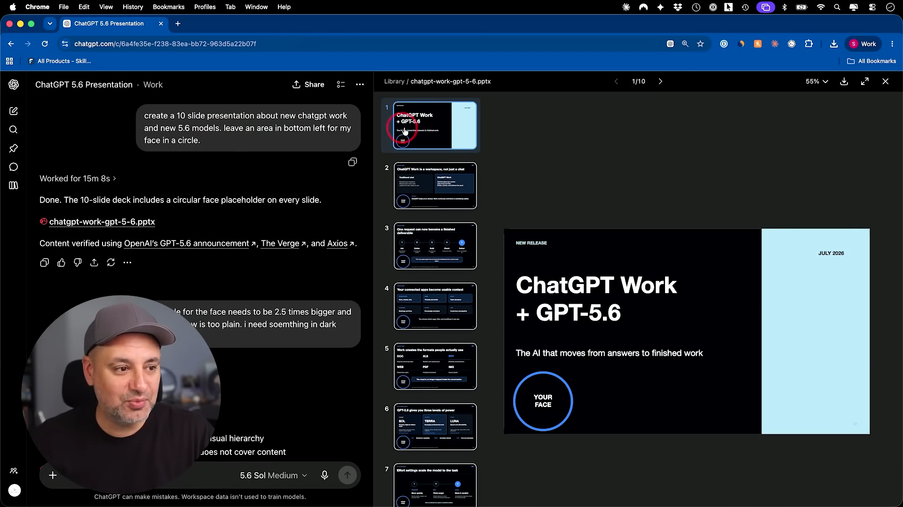
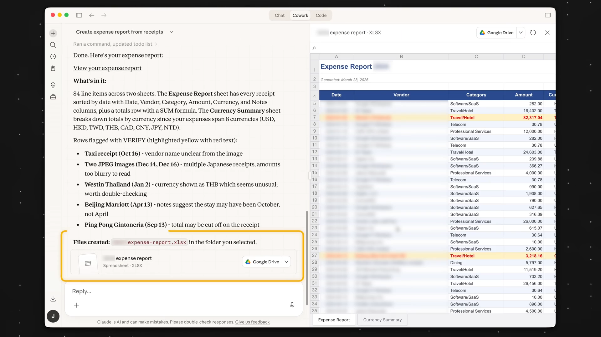
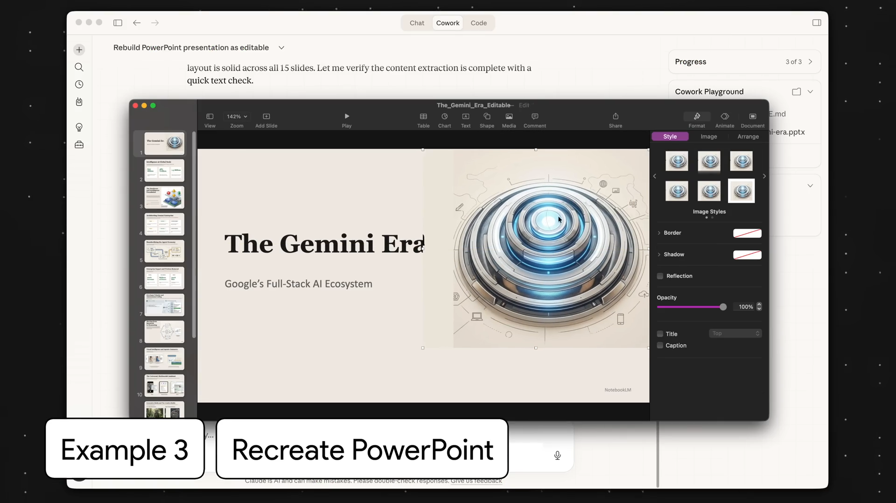
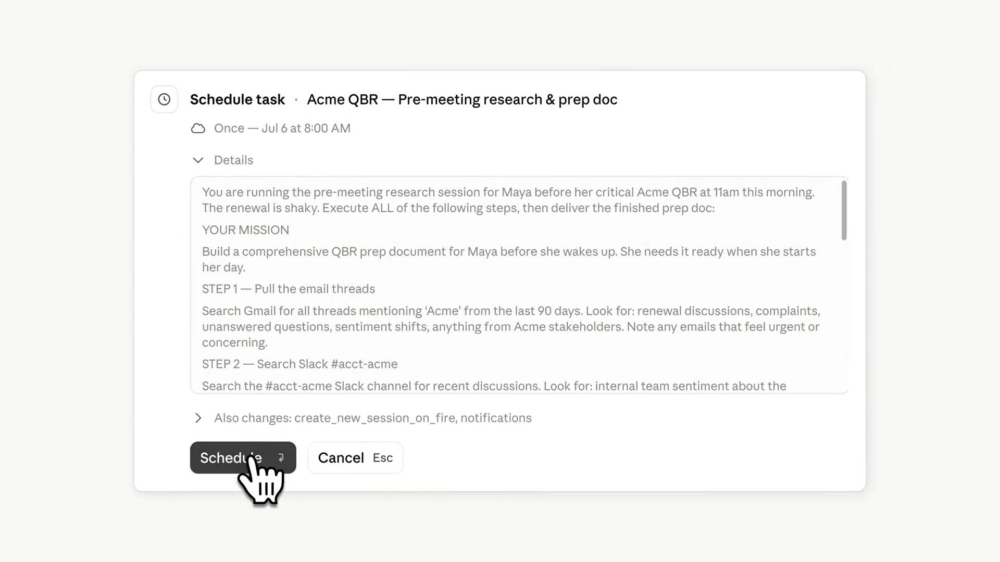

# ChatGPT Work vs Claude Cowork: Finance Doesn't Need a Smarter Chatbot

On one screen, ChatGPT Work spent about 15 minutes producing a sourced 10-slide PowerPoint. The output was a real `.pptx`, not an outline waiting to be copied into PowerPoint.

On another, Claude Cowork took a folder of more than 100 receipt images and returned an expense workbook with 84 line items across two sheets, formulas, currency summaries, and rows marked `VERIFY` when the source image was unclear.

The second result is less glamorous. It is also closer to the reason this comparison matters for finance. A useful financial agent should not only produce an answer. It should create an editable workpaper, preserve the relationship to source material, and make uncertainty easier to review.

There is an important limitation: this is not a fair long-duration benchmark. [OpenAI launched ChatGPT Work](https://openai.com/index/chatgpt-for-your-most-ambitious-work/) on July 9. Claude Cowork has been in users' hands since January. One product has a day of public evidence; the other has six months of workflows, workarounds, complaints, and failures.

That asymmetry leads to a more honest conclusion than declaring a winner. ChatGPT Work has more surface area. Claude Cowork has more scar tissue. The real contest is not over which model sounds smarter. It is over which product can own the context, execution, artifact, and control planes around knowledge work.

For finance teams, that control plane matters more than the chatbot.

I care about that distinction because I have already seen what happens one layer below the workspace. Earlier this year, I ran Claude's finance plugins on DCF, client-report, and investment-recommendation work. The value was not a flawless final answer. It was turning a blank file into a structured, editable starting point that a qualified person could review. Work and Cowork are now competing to own everything before and after that file.

*A launch-day ChatGPT Work walkthrough produced a sourced 10-slide `.pptx`. Source: [Skill Leap AI](https://www.youtube.com/watch?v=TUu5SuFcf44), 04:08. This is a visible demo, not a controlled benchmark.*

*Claude Cowork turned 100+ receipt images into an 84-line workbook and surfaced uncertain rows for review. Source: [Jeff Su](https://www.youtube.com/watch?v=z9rdrNrkvDY), 04:53.*

## The Products Converged Faster Than the Evidence

The launch narratives make ChatGPT Work and Claude Cowork sound almost identical. Give the agent a goal. Connect files and apps. Let it work in the background. Review a finished document, spreadsheet, deck, or report.

That description is accurate but incomplete. The products have converged at the feature level faster than the evidence around them has converged.

| Dimension | ChatGPT Work | Claude Cowork |
|---|---|---|
| Surfaces | Cloud on web/mobile; local files and apps on desktop | Cloud web/mobile beta; local files and apps on desktop |
| App access | Plugins, built-in browser, desktop app access | Connectors first, then browser, then screen interaction |
| Deliverables | Documents, spreadsheets, presentations, reports, Sites | Documents, spreadsheets, presentations, reports, local files |
| Customization | Unified plugin directory across the ChatGPT product | File-based plugins with skills, connectors, commands, and sub-agents |
| Recurring work | Scheduled, event-triggered, and monitoring tasks | Scheduled tasks that can now continue without a device online |
| Finance layer | ChatGPT for Excel/Sheets and financial data integrations | Finance plugins plus Claude for Excel and PowerPoint |
| Public maturity | Launched July 9, 2026 | Launched in January; cloud expansion July 7, 2026 |

OpenAI is pulling more surfaces into one product. Chat, Work, and Codex divide conversation, knowledge work, and software development. Work can use plugins, a built-in browser, connected applications, and a new Sites feature that turns analysis into a shareable dashboard or web application. On desktop, it can also use local files and applications. One launch limitation is revealing: [cloud Work conversations do not yet appear in desktop Work](https://help.openai.com/en/articles/20001275-chatgpt-work-and-codex). The ambition is unified; some of the state is still fragmented.

Anthropic arrived by a different route. Cowork grew out of Claude Code's ability to work with files and tools, then added plugins, scheduled tasks, computer use, and Office workflows. Its computer-use design exposes an important operating choice: [Claude tries a connector first, then the browser, then direct screen interaction](https://support.claude.com/en/articles/14128542-let-claude-use-your-computer-in-cowork). That hierarchy matters because direct integrations are faster and more reliable than moving a mouse across a screen.

Neither architecture is finished. The difference today is that Cowork has had longer to meet messy work.

The economics are not comparable yet either. OpenAI says Work follows Codex's usage structure and that more complex tasks consume more allowance. Cowork users already have strong opinions about five-hour and weekly limits. A static price table would create false precision before teams know how many real work runs each plan can support.

## Surface Area Versus Scar Tissue

ChatGPT Work's strongest launch advantage is breadth. OpenAI can connect a research task to the web, a spreadsheet, a presentation, a shareable Site, and a coding workflow without asking users to assemble a separate toolchain. Its distribution advantage matters too. ChatGPT already has a massive installed base, and Work appears inside the product people know.

The launch-day PowerPoint demo shows why that breadth is attractive. The agent researched a topic, cited sources, created a deck, and left an editable file behind. The output still needed human taste. The first draft was visually plain and text-heavy, and the creator immediately asked for revisions. That is not a failure. It is a realistic division of labor: the agent removes the blank page; the operator sets the quality bar.

Cowork has a denser body of file-native evidence. In the receipt workflow, it did more than extract text. It created a workbook with a totals structure and marked exceptions where the source could not support a confident value. In another task, it took slides that existed only as images and rebuilt them as an editable PowerPoint with real text boxes.

Anthropic's own usage analysis says more than 90% of Cowork sessions are not software development, and that business operations plus content creation account for roughly half of use. That is a vendor analysis rather than an independent audit, but it fits the workflows now visible in the community: reporting, onboarding, spreadsheet reconciliation, client materials, and recurring preparation work.

*Cowork rebuilt image-based slides into an editable presentation. Source: [Jeff Su](https://www.youtube.com/watch?v=z9rdrNrkvDY), 06:07.*

That is what I mean by scar tissue. Mature products do not only accumulate features. They accumulate evidence about where the work breaks.

Cowork users complain about weekly usage ceilings even when shorter-term limits are temporarily doubled. One user reported that an update removed important history and work; other commenters said their history remained intact. The highest-value response was not a theory about the incident. It was an operating rule: keep memory and context in files, Git, or cloud storage rather than trusting chat history as the only system of record.

That advice applies to both products. The moment an agent owns work across hours, applications, and devices, state becomes part of the product. A lost conversation is no longer an inconvenient chat bug. It can be a lost workpaper, an unrecoverable assumption, or a missing approval trail.

ChatGPT Work will accumulate its own scar tissue. It simply has not had enough time yet.

## Finance Makes the Difference Visible

Financial work is rarely one prompt. A month-end package may start with data from several systems, move through reconciliation and model updates, become commentary and a deck, then pass through review and approval. Every transition creates a place where context can be lost or a number can become detached from its source.

OpenAI and Anthropic both understand the opportunity. OpenAI describes Work helping finance teams locate source data, move it into Excel or Sheets, reconcile it, create slides, and verify the result. [ChatGPT for Excel and Google Sheets](https://openai.com/index/chatgpt-for-excel/) is already generally available, with financial-data integrations and workflows around modeling, scenario analysis, and research.

Anthropic has gone deeper into packaged finance workflows. [Its finance plugin collection](https://claude.com/blog/cowork-plugins-finance) covers financial analysis, investment banking, equity research, private equity, and wealth management, with connectors for institutional data providers. Claude can also carry context between Excel and PowerPoint. Anthropic's own finance team says it uses Cowork for synthesis and narrative work while using Claude for Excel inside the model.

In those finance plugin tests, the most valuable result was the difference between a blank workbook and a correctly structured workbook with formulas, assumptions, and a sensitivity table already in place. I wrote about the outputs in [my hands-on review of Anthropic's finance stack](/blogs/anthropic-finance-plugins-insider-take).

ChatGPT Work and Cowork move the question one level up. A well-designed skill can encode how to build a DCF or an IC memo. The workspace determines whether that skill can reach the right data, operate the right applications, create the right artifact, expose the exceptions, and return the work for review.

In finance, uncertainty surfaced is often more valuable than confidence performed. A polished number with weak lineage is a liability. A highlighted exception with a clear source is work a reviewer can finish.

## The Four-Plane Test

The cleanest way to compare these products is to stop asking which one is "better" and test the four planes that make an AI workspace operational.

### 1. Context

Where do the source data, project instructions, templates, prior decisions, and institutional knowledge live? Can the agent read them without copying sensitive material into an unmanaged chat? Can the organization version and move that context later?

Cowork's file-based plugins are strong here because skills, connectors, commands, and sub-agents can be inspected and customized. ChatGPT Work's advantage is the breadth of its connected plugin surface and the proximity of Chat, Work, and Codex. The open question for both is whether the most valuable context remains portable enough for the customer to own.

### 2. Execution

Where does the work run, and which tools can it operate? Cloud execution keeps work moving when a laptop is closed. Local execution reaches files and desktop applications that should not be moved into the cloud. Browser and screen control fill integration gaps, but they are slower and more error-prone than direct connectors.

Both products now span cloud and desktop. Both support recurring work. The meaningful test is not whether a schedule button exists. It is whether a scheduled task can reach the right systems, pause at the right decision, and leave enough evidence to understand what it did.

*Anthropic's cloud Cowork demo schedules a QBR preparation task across email and Slack. Source: [Claude](https://www.youtube.com/watch?v=XNbc2HhL7J4), 00:22.*

### 3. Artifact

Does the agent return the format the work actually requires? A financial model needs formulas and linked cells. A deck needs editable text, layouts, and source notes. A reconciliation needs an exception log. A report needs to distinguish evidence from interpretation.

This is where Cowork currently has stronger public proof, because users have been testing it longer. ChatGPT Work's early deck and Site demonstrations are promising. The next question is consistency: can the product preserve artifact quality across repeated runs and firm-specific templates?

### 4. Control

Who can authorize access? Which actions require approval? Where are source lineage, logs, cost, and task history recorded? What happens after a wrong update or a lost session? Can the team recover without reconstructing the workflow from screenshots and memory?

OpenAI and Anthropic both offer enterprise controls, and both acknowledge that computer use carries risk. Anthropic explicitly warns that screenshots used for computer interaction can expose anything visible in an approved application and that safeguards are not perfect. These are not edge concerns for finance. They are deployment requirements.

| Plane | What to test | Evidence that should remain |
|---|---|---|
| Context | Can it find the right source and apply firm instructions? | Source references, versions, assumptions |
| Execution | Can it move across systems and stop for judgment? | Tool history, approvals, intermediate state |
| Artifact | Is the output editable, linked, and exception-aware? | Formulas, citations, change notes, exception log |
| Control | Can access, cost, error, and recovery be governed? | Permissions, audit trail, rollback, runbook |

A useful finance pilot should force all four planes to work. Give both products the same synthetic month-end package. Ask each to reconcile source files, update a model, write variance commentary, build a management deck, and leave an exception log. Measure speed, but do not stop there. Check whether every number can be traced, every output can be edited, uncertainty is visible, and approvals occur at the right points.

Then break the run on purpose. Replace one source file with a stale version or introduce a mapping error. See whether the agent notices, whether the evidence trail reveals what changed, and whether a reviewer can recover without starting over. A workbench should be evaluated by its return path, not only its happy path.

That test will tell you more than a model leaderboard.

## The Honest Answer May Be a Boundary, Not a Winner

The obvious objection is that sophisticated users will use both. I already use multiple agents because different tools are better at different parts of my work. A hybrid stack can be rational.

For an individual, the boundary can live in habit: use one tool for research, another for files, a third for code. For an institution, that is not enough. Someone must decide where sensitive data can move, which system owns the task history, how approvals are recorded, and what happens when one agent hands work to another.

Today I would start Cowork-first when the workflow is dominated by local files, customizable domain plugins, and editable Excel or PowerPoint deliverables. I would start ChatGPT Work-first when the workflow spans many SaaS applications, web research, shareable Sites, and a unified path between conversation, knowledge work, and code.

I would not standardize either product across finance from a generic pilot. Start with one bounded workflow, one accountable owner, synthetic or approved data, and a defined evidence bar. Keep the durable assets outside the vendor wherever possible: skills, templates, evaluation sets, permission rules, audit history, and runbooks.

This is the same principle I argued in [Expensive Tokens Won't Save Enterprise AI](/blogs/why-ai-companies-are-becoming-deployment-companies): a deployment should leave the customer more capable, not merely more dependent on a capable vendor.

## The Workspace Is Becoming the Product

My earlier conclusion was that skills were becoming the product. I still believe that. A firm's investment process, risk rules, reporting standards, and client language become more valuable when they can be encoded, reviewed, and reused.

ChatGPT Work and Claude Cowork reveal the layer forming around those skills. The workspace decides what context reaches them, how long they can run, which applications they can operate, what artifact they produce, and how the organization reviews and recovers the work.

That is why the winner will not be determined by the most impressive first answer. It will be determined by which system can turn institutional knowledge into controlled, editable work without making the organization forget how the work happened.

For finance, the standard is simple. If the source cannot be traced, the exception cannot be seen, and the workbook cannot be reviewed, the task is not done.

The chatbot can be brilliant. The workbench still has to be trustworthy.

*I write about building AI-native systems at the intersection of financial services and product. Follow for more operator research on what changes real work.*
