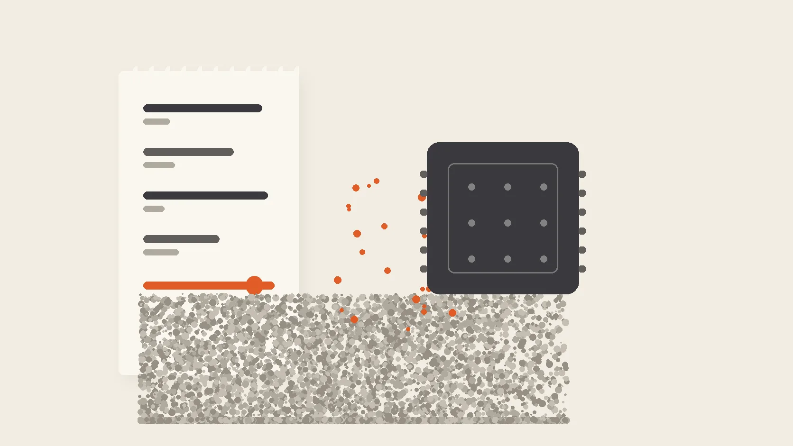

Yesterday, the work my agent produced came with an invoice line I could not map back to the work it bought. Today, the same kind of work — including this sentence — runs on chips I own, through a harness with no billing surface at all. The model in the middle is a 27B open-weights file I pulled from Hugging Face. The pin, because receipts matter: DeepSeek Harness 0.1.0-rc.8, Qwen3.8-27B at Unsloth Q8_0, Ollama on a M5 Max MacBook with 128GB of unified memory.

No cloud tokens. No meter.

The point of this post is not that a 27B model is impressive. The coverage is better than my review would be, and the same coverage is careful to say that being close to frontier is not being equal to frontier. The point is what changed inside my workflow the moment the per-token meter left the room: what you buy when intelligence stops being rented, and where quality responsibility goes when the meter is gone.

## The crossover just became real

The capability side of the crossing arrived in mid-August 2026, when Alibaba open-sourced Qwen3.8-27B. The movement data: a million-plus downloads inside roughly two days, the top of Hugging Face's global trending list, and within four days the most-chosen local model among Cline's developer users, per the coverage in [pingwest](https://www.pingwest.com/a/316634) and [Pandaily](https://pandaily.com/qwen3-8-27b-new-model-kill-line-local-opus-consumer-hardware-aug2026). Its score on the Artificial Analysis Intelligence Index is 52, which puts it in the same band as models like GPT-5.6 Luna and DeepSeek V4 Flash. The community nickname is "local Opus 4.6". The coverage that produced the nickname is also the coverage that adds the caveat: on the hardest tasks, the gaps are real.

That caveat is exactly the point. A model does not need to beat the frontier at everything to change what you buy. It needs to be good enough that the work class in question clears its bar, at a size a machine you might already own can run — roughly 17GB of weights at 4-bit, or about 28GB at the Q8 quantization I serve locally, which is why this machine has 128GB.

The price side moved at the same moment. In mid-August, DeepSeek raised V4-Pro peak-hour output pricing from 6 to 27 yuan per million tokens — 4.5x — and introduced peak/off-peak billing; per that same coverage, Zhipu and Kimi had already moved theirs, and a single coding-agent task generating hundreds of thousands of tokens is now common plumbing.

Every repeat run pays the meter again, and the meter follows the price sheet, which now moves with seasons. I am not betting on the price sheet. I mark the line on the capability side, because the price sheet is the one variable I had no control over — and it just moved 4.5x on the number that decides what a recurring agent workload costs.

## What zero marginal cost reveals

When the meter leaves a workflow, a cost that was never on the invoice shows up. It was there all along; the subscription just paid for it on my behalf.

The local model has less margin. At launch, per the coverage, it thinks longer than its peers and still misses the hard band — Simon Willison got a twenty-one-minute reasoning session to draw a pelican on a bicycle. In this session, the process caught things the model could not: the style scanner rejected the first draft's ending as a summary instead of a rule; the claim ledger refused a precise Qwen release date, because the outlets disagreed on the day, and the article now says mid-August. This pattern is the mirror of what [I wrote in August](/blogs/ai-made-process-cheaper-judgment-is-still-expensive): process is cheap, judgment is still expensive, and 178 green tests once shipped a real loader failure.

On a frontier cloud model, the raw capability margin sometimes carries the work through. On a 27B local model it does not. So the difference between output and slop comes from the machine around the model — the gates that reject, the skills that carry context, the memory that persists, the log that records. [I argued in the DeepSeek Harness teardown](/blogs/deepseek-harness-teardown) that this harness layer is where completion, cost, and audit are actually decided. The local stack just removes the one surface I previously used as a proxy for all three: the billing page.

The audit itself changes character. On the cloud, the provider's event log is an internal record that happens to produce an invoice. On the local stack, the same append-only log is the only receipt that exists — I can open it right now and read the thousands of lines this session wrote: what the model claimed, what the gates rejected, what I corrected line by line. That kind of visibility is something no cloud vendor gives you, because the log is the vendor's product, and the invoice is its evidence.

## Self-referential, and I will say so

This article is being written by the system it describes. I am reviewing my own broadcast on my own channel, and a skeptic is entitled to call that a conflict of interest. I will not argue against it. The receipts are how I address it: every load-bearing fact above is version-pinned, and every adversarial check lives in the working session, not in a curated story. The scanner flagged a draft section before it reached the final shape. The ledger excluded a date I would have liked to pin. The session log records the whole production run — the model's claims, the gates' rejections, my corrections line by line — which is a stronger receipt than any claim I could make about the machine's honesty.

You are not being asked to trust the model on this post. You are being asked to notice what the machine around it did.

## What the local stack gives up

A 128GB machine has a purchase price, and pretending otherwise would be a worse error than what this post is trying to correct. And the frontier still owns the hard band: the deep-reasoning tasks, the long multi-file refactors, the one-shot work where you need the top of the capability curve. Those stay on the cloud. The crossover is per work class, and any version of "everything moves local" is going to be wrong the first week you hit the hard band.

The framing that does survive is a cost-structure one. The invoice is recurring: it comes back for every run, forever, and it follows the price sheet. The machine is amortized: it pays once. When per-task metering stops being rounding error and becomes structural cost — which is precisely where agent work is, because agents repeat — the two curves cross. I am not claiming that crossing justifies any particular purchase. I am claiming the arithmetic changed, and the change is per work class, not per model.

One operator consequence follows, and it is what I would actually act on. In the classes that cross, the investment order flips: the harness becomes the product. The model on the local shelf is swappable — when the next 27B-class release lands, it replaces the file, and the gates, the skills, the memory, and the audit keep working unchanged. The asset that compounds is not the model file. It is the portable layer that reads it.

## The local crossover test

So here is the test instead of my conclusion, because the test is something you can run on your own workloads where mine cannot.

For any recurring agent workload, three questions:

1. **Capability.** Does a 27B-class model clear this work class's bar on your own checks, not a benchmark's?
2. **Recurrence.** Is per-token metering structural cost for this class, or rounding error?
3. **Audit.** Does your harness's gate plus log replace what the vendor's SLA and invoice used to give you?

Pass all three and that class moves local; fail one and you rent it deliberately. The validation takes an hour: run one real workload through your harness on a 27B GGUF, read the audit log, and diff it against your last cloud run of the same class. The gap you find is your line.

So the rule from now on: stop asking the vendor how much the metering costs you. Ask what it is worth to you, per work class, and only move the ones that clear the line — because when marginal cost hits zero, the model stops being what you rent, and the environment is what you buy.

The DSH line [started with what the harness actually decides](/blogs/deepseek-harness-teardown). This is its first receipt from the stack itself. *The series continues with what the local stack refuses and what that refusal is worth — [subscribe to the newsletter](https://www.aaronguo.com/newsletter) to follow it.*
