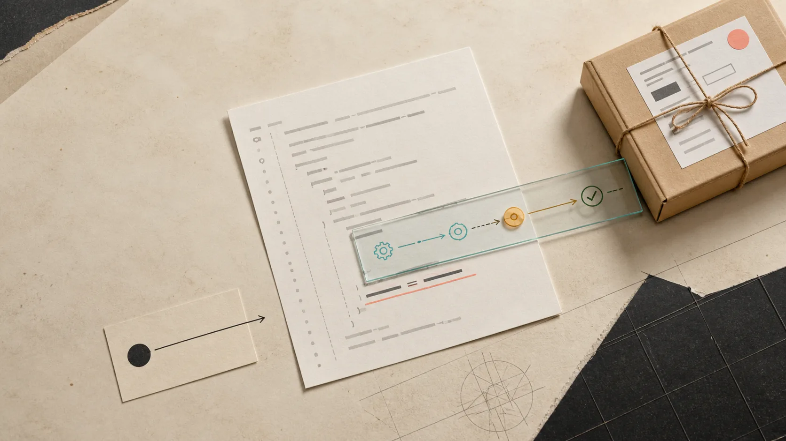
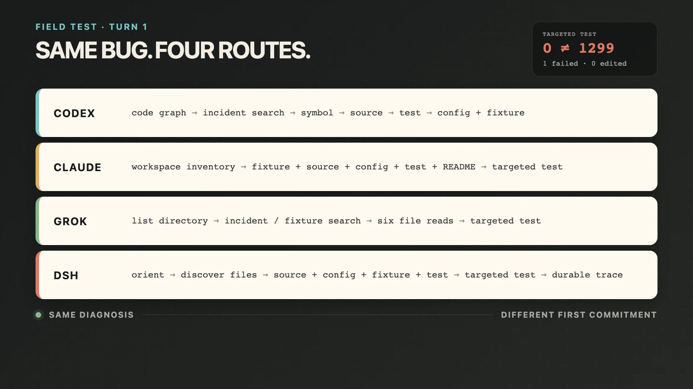
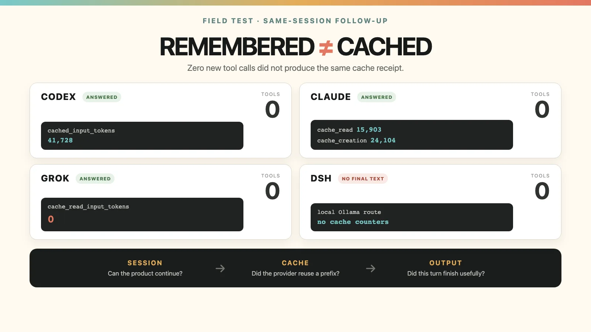

# DeepSeek Harness 学习：一条 Prompt 到答案前，发生了什么？



我想看看 DeepSeek Harness 和 Codex、Claude Code、Grok 的设计到底有什么不同。

所以我给它们同一个小事故：一个加拿大电商订单，金额是 79.99 加元，本来应该收 12.99 运费，系统却免邮了。

问题藏在这行代码里：

```js
return order.subtotalCents >= rule.freeShippingThresholdDollars
  ? 0
  : rule.baseRateCents
```

订单金额是 `7999` cents，免邮门槛是 `80` dollars。代码直接比较，`7999 >= 80`，于是免邮。

相关测试的输出很清楚：

```text
✖ INC-2047 charges shipping below the Alberta free-shipping threshold

AssertionError: Expected values to be strictly equal:
0 !== 1299

tests 1  pass 0  fail 1
```

这个例子不难，但它要求 agent 搜索 incident、读取 fixture、找到 config，再运行一次指定测试。刚好可以看清 harness，而不会被大型 repo 的噪音盖住。

我要求四个 agent：只读，不改代码；测试只跑一次；并给出根因、最小修复、风险，以及工具调用顺序。

四个都找对了。真正有意思的是，它们怎样到达同一个答案。

## 第一轮：它们实际调用了什么

| Harness | 这次实测看到的顺序 |
|---|---|
| Codex | code graph/discovery → 搜 incident → 找 symbol → 读 source → 跑测试 → 搜 threshold → 读 config 和 fixture |
| Claude Code | 看 workspace → 读 fixture、source、config、test、README → 跑测试 |
| Grok | 列目录 → 搜 incident/fixture → 连续读六个文件 → 跑测试 |
| DeepSeek Harness | 定位目录和文件 → 读 source、config、fixture、test → 跑测试 → 写结论 |



这里最容易误判的是 Claude 和 DSH。看 transcript，它们都只是读文件、跑测试，似乎没有区别。

区别不在 `read` 这个动作，而在谁负责组装 agent。

Claude Code 是一个比较完整、意见明确的产品：全局规则、permission mode、工具和自动上下文管理已经组成一套运行时。我这次还明确用了 plan mode，所以治理模式从第一轮就在场。

DSH 更像一盒可以拆开的零件：model route、tools、safety、session persistence、compaction 都是显式的 composition。它不保证更轻，也不保证答案更好；它的优势是你能追问：这次到底装了什么，哪一步写进了 session，之后怎么回放。

Codex 在我这台机器上先摸向了已经配置好的 code graph。这对三文件项目显得重，但对真实大 repo 很合理。Grok 的路径最接近传统终端习惯：先看目录，再搜，再读。

所以第一轮不是在比较谁更聪明，而是在比较四种默认判断：先建立项目地图，先带上治理环境，先用普通文件工具取证，还是把整个 agent loop 做成可组合、可回放的对象。

## Prompt 并不是直接送给模型

用户输入只是一部分。第一次 model call 之前，harness 还会决定：

- system instructions 和 repo rules 带多少；
- 把哪些 tool schema 直接放进去；
- 哪些能力需要用到时再发现；
- 当前 permission、mode 和 session state 是什么。

第一次 model call 之后，它又接管循环：执行工具、把结果送回模型、记录状态，直到得到 final answer。

因此同一句 Prompt，在四个产品里并不是同一个 request。我们通常只看见输入框和答案，中间那层才是 harness。

## 第二轮：记得，不等于命中 cache

只测第一轮不够。Prompt cache 的价值通常出现在后续对话。

我在同一个 session 里继续问：不要重跑测试，也不要重读文件；比较“把 config 改成 cents”和“在比较处乘以 100”哪个 blast radius 更小，并补一个 regression test。

结果如下：

| Harness | 新工具调用 | Follow-up | 产品报告的 cache 字段 |
|---|---:|---|---|
| Codex | 0 | 正确复用证据并建议改 comparison code | `cached_input_tokens: 41,728` |
| Claude Code | 0 | 正确复用证据并建议增加 BC 边界测试 | `cache_read: 15,903`；`cache_creation: 24,104` |
| Grok | 0 | 正确复用证据 | `cache_read_input_tokens: 0` |
| DSH + 本地 Qwen | 0 | session 接受了第二轮，但本地模型到达 1,536 output-token 上限，未产出 final text | Ollama 路径未暴露 cache read/write counter |



这次测试给了我一个比 token 排名更有用的结论：

> Session 能续上，不等于 provider cache 命中。

Grok 明明记得前一轮证据，也没有重新调用工具，但这次报告的 cache read 是 `0`。产品可以从自己的 session store 重建对话，再把它作为新输入发给模型；是否命中 provider 的 prefix cache，是另一层机制。

Claude 的结果也值得看。第二轮同时出现 cache read 和 cache creation。也就是说，一部分稳定前缀被复用，新的对话后缀又被写入 cache。所谓 warm conversation，不是简单的 hit/miss 开关。

这些数字不能横向比大小。四家统计边界不同，Claude 的 stream 还可能聚合多次内部 model call，DSH 又走本地 Ollama。但原始字段可以回答一个更严谨的问题：这一次产品有没有报告 reuse，以及 reuse 发生在哪一层。

## Cache 和 compaction，方向刚好相反

Cache 想保留完全相同的前缀，让它下次更便宜。

Compaction 则在历史太长时，删掉 tool output 或把旧对话改写成 summary。它牺牲精确历史，换取继续对话的空间。

所以长时间运行的 agent 迟早要做一个选择：什么时候继续复用“准确但很重”的过去，什么时候把它压成“便宜但有损”的状态。

四个 harness 的差别在这里更明显：

| Harness | 压缩机制 | 压缩后你能看见什么 |
|---|---|---|
| Codex | 有自动压缩阈值和手动 compact 事件；Responses API 会返回 opaque encrypted compaction item | 控制和事件可见，但 compacted item 主要用于续跑，不是给人审阅的摘要 |
| Claude Code | 先清理旧 tool output，再总结历史；root instructions 和 auto-memory 会重新注入，一些 path-scoped context 需要重新读取 | 官方把“哪些会回来、哪些可能丢失”写得最清楚 |
| Grok | 提供 `/context`、`/compact`、`/resume` | 用户有明确控制，但公开文档没有 Claude 那么细的 survival contract |
| DSH | 根据具体模型窗口计算阈值，可先 prune tool result，保留 tail，再用指定模型总结一段历史并写入 durable session | threshold、retain tail、summary model、usage 和事件都能成为 composition point |

Codex 的 compaction controls 和事件可以在官方 [config schema](https://github.com/openai/codex/blob/main/codex-rs/core/config.schema.json) 与 [app-server 文档](https://github.com/openai/codex/blob/main/codex-rs/app-server/README.md) 中找到；OpenAI 对 compacted response 的定义是一段用于继续推理的 opaque encrypted item，而不是方便人类审查的普通摘要。[Responses compact reference](https://developers.openai.com/api/reference/java/resources/responses/methods/compact)

Claude Code 的文档明确写了自动压缩会先清理旧 tool output，再总结历史；root `CLAUDE.md` 与 auto-memory 会重新注入，而某些 path-scoped rules 需要重新读文件才回来。[Claude Code context window](https://code.claude.com/docs/en/context-window) 这比一句“支持 `/compact`”有用得多，因为它告诉 operator 压缩之后应该重新验证什么。

Grok Build 暴露了 [`/context`、`/compact` 和 `/resume`](https://docs.x.ai/build/modes-and-commands)，但公开说明更偏向操作入口。

DSH 最有学习价值的地方，是 compaction 本身也可以拆开看。在我检查的 `141eb6fef834` 源码里，`BasicCompactionEngine` 会：

1. 按目标模型的 context window 和 ratio 算 threshold；
2. 必要时先 prune tool result；
3. 选择一段旧历史，同时保留配置好的 tail；
4. 用可指定的 provider/model 做 summary，并把 purpose 标成 `compaction`；
5. 把替换结果和 usage 持久化，超限时做有上限的 retry。

这不是“DSH 压缩得更好”的证据。它说明的是：DSH 把压缩策略从一个黑盒产品行为，变成了可以配置、测试和审计的工程部件。

## 真正该比较的，是两轮之间发生了什么

做完这次测试，我觉得比较 harness 的单位不该是一条 Prompt，甚至不该是一次 request。

应该比较一次 state transition：

```text
用户 Prompt
  → harness 加入规则、工具和权限
  → model 决定调用工具
  → harness 执行并记录证据
  → session 保存状态
  → provider 可能复用稳定前缀
  → 历史过长后，compaction 决定哪些细节还能活下来
```

下一次答案出问题时，我想要五张收据：

1. 最初带进了什么？
2. 后来用工具发现了什么？
3. provider cache 实际复用了什么？
4. session 持久化了什么？
5. compaction 删掉或总结了什么？

这五件事经常被混成一个词：context。但它们的故障方式完全不同。

工具选错，是 discovery 问题；第二轮重复读文件，可能是 session 问题；session 正常但 cache miss，是成本问题；压缩后忘掉早期约束，是 compaction 问题。

这也是我现在看 DSH 的方式。它不只是 DeepSeek 模型外面的一圈工具。它更像一份可以展开的 agent runtime：每一步都在逼你决定，什么应该进入、留下、复用，又允许什么被忘掉。

这比“哪个 coding agent 更聪明”更值得测。

---

*方法说明：测试时间为 2026-08-23。四个产品各做一次只读首轮和一次同 session follow-up；模型、订阅、个人配置和 token 统计边界不同，因此本文不比较智力、速度、价格或总 token。DSH 首轮使用 headless profile；同 session API 测试使用 SDK composition，后者不参与首轮工具路径排名。完整脱敏 protocol、版本、原始字段和限制记录在同目录 field note 中。*
