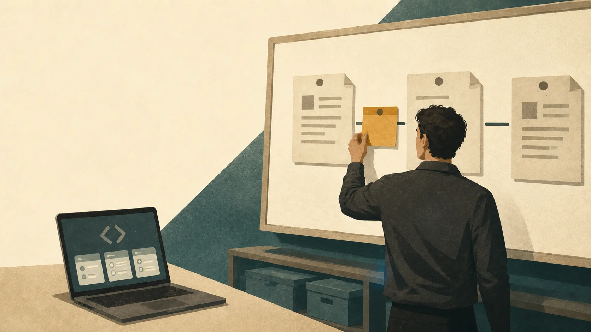
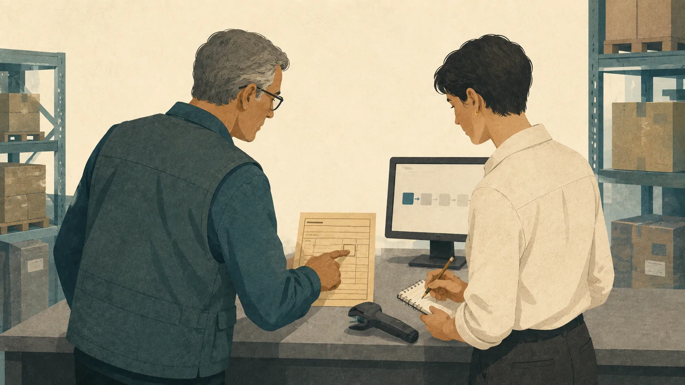
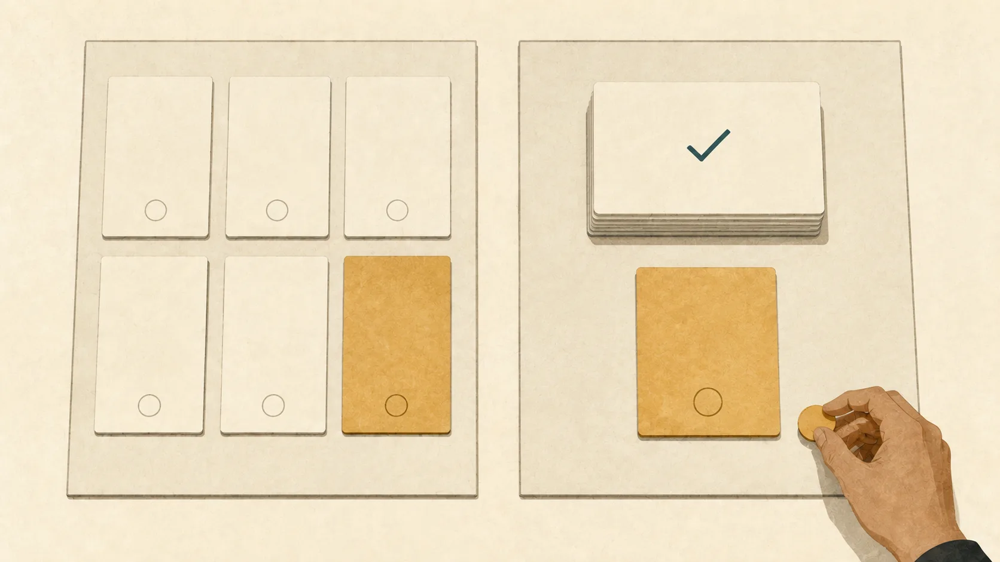
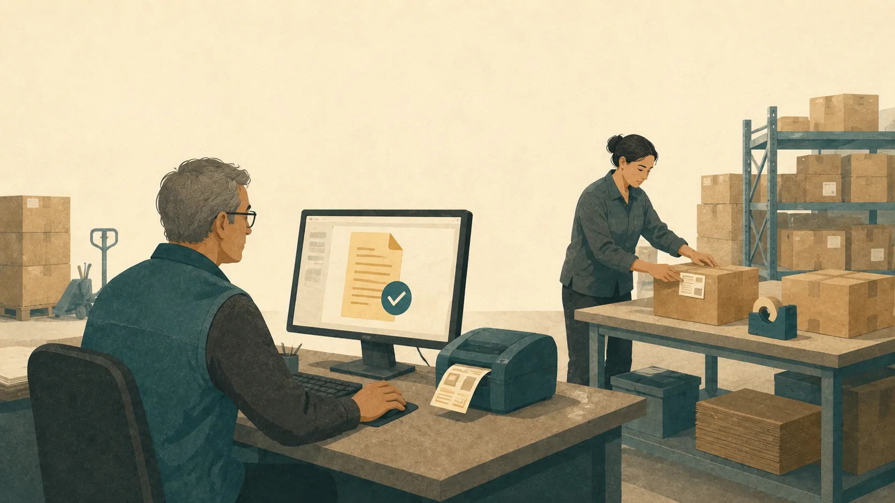

# As AI Takes On More Coding, Get Closer to the Business

Years ago, while working at Amazon, I had already reached a conclusion: a company can afford to provide a lot of desirable jobs without needing a team of that size to create the business value it delivers.

In my view, organizations sometimes expand because of departmental interests, management layers, and internal politics. Teams grow. Coordination grows with them. The problems customers need solved may grow much more slowly. Someone can be working hard while their abilities are absorbed by work the organization has created for itself.

So Amazon's later restructuring and layoffs didn't surprise me. In 2024, the company announced plans to reduce management layers and unnecessary processes. In 2025, Andy Jassy said he expected efficiency gains from widespread AI use to reduce Amazon's total corporate workforce over the following years. Its January 2026 layoff announcement again emphasized fewer layers and less bureaucracy. [Organizational changes](https://www.aboutamazon.com/news/company-news/ceo-andy-jassy-latest-update-on-amazon-return-to-office-manager-team-ratio), [Jassy on AI](https://www.aboutamazon.com/news/company-news/amazon-ceo-andy-jassy-on-generative-ai), [the layoff announcement](https://www.aboutamazon.com/news/company-news/amazon-layoffs-corporate-jan-2026).

My interpretation is that, as AI lowers the cost of some execution work, it also accelerates the reassessment of existing roles and organizational structures. A layoff cannot tell us what an individual contributed. It does, however, make me think carefully about how the abilities I'm building connect to actual needs.

**To prepare for the next five to ten years, I want to invest more of my career in understanding customers, making product decisions, and taking responsibility for results.** AI gives engineers more capacity to execute. We should use it to expand the problems we can solve and participate in deciding what deserves to be built.

## Cheaper implementation gives us room to change our work

A few recent engineering interviews made this change concrete for me. Boris Cherny described having Claude Code write his code while he continued to review it. Simon Willison described quickly trying alternative prototypes and argued for testing with real users to help choose between them. Both point to room for engineers to spend their time differently as tools take on more implementation. [Boris's practice](https://www.youtube.com/watch?v=We7BZVKbCVw&t=977s), [Simon's prototype discussion](https://www.youtube.com/watch?v=wc8FBhQtdsA&t=1287s).

There's a long history behind this. In his account of C's development, Dennis Ritchie described the advantages of languages above assembly: programs became easier to write and understand. Libraries, frameworks, and tools have continued to remove repetitive detail from developers' work. AI hands some implementation to agents, changing even how we try out a possible solution. [Ritchie's account](https://www.nokia.com/bell-labs/about/dennis-m-ritchie/chist.html).

What interests me is the opportunity to rearrange our time. Implementing an idea could once consume almost all the energy one person had for it. On tasks suited to AI, we can now devote more attention to earlier decisions and follow the work further into actual use.

Business knowledge has always mattered. The reason to invest more deliberately now is that a need you understand has a better chance of being tested and addressed at a lower implementation cost. Engineers can develop these abilities together, within the same project. Here are five places I'd start.

## 1. Learn an industry deeply

Choose an industry you want to understand over time, and keep learning how it works.

Who uses the product? Who decides to buy? Where does a piece of work begin and end? Who bears the consequences when something goes wrong? Learn these things alongside the technology. They determine what a feature means in that business and whether a proposed solution will work there.

Kent Beck used payroll software to make a related point in an interview: calculating an amount covers only part of the visible functionality, with broader business responsibilities behind it. Similar interfaces can carry very different obligations in different businesses. [The interview](https://www.youtube.com/watch?v=ddHQQtjIOpw&t=8053s).

As AI makes it easier to try a technology or build an initial version, I'd reserve some learning time for this background. Follow a business process through your current project. Record the recurring exceptions, roles, and decisions, then test that understanding on the next project.

Over several years, this can help you notice problems that haven't reached a requirements document yet: why customers repeatedly get stuck in the same place, why existing products leave it unresolved, and what would have to change to make a solution worthwhile. That's where industry knowledge becomes useful judgment.

## 2. Spend time with customers

Seek opportunities to talk directly with customers and see when they need a product—and why they abandon it.

A requirements document often contains an answer that someone has already organized. To understand the problem behind it, ask a user to show you how they do the work today. Notice where they stop to get confirmation and which mistakes force them to start over. That gives you a basis for judging what an improvement would accomplish.

Suppose you're building a tool that automatically processes business documents. The demo extracts information beautifully. The customer may care most about unusual cases: who confirms them, how mistakes are corrected, and whether the existing system can remain in use. Completing that part of the workflow might be what makes the product worth adopting.

This changes what you build next. You might have planned to polish the extraction interface and discover that exception handling needs testing first. You might expect users to care most about speed and find that they don't trust the result. Direct contact lets an engineer correct the direction before investing heavily in implementation.

I'd use some of the coding time saved here. On your next request, try to speak with a user. After delivery, see whether they actually use what you built. Repeated contact with similar customers helps distinguish passing preferences from recurring difficulties and needs worth solving.

## 3. Practice product decisions

As implementation gets easier, be more deliberate about what to build first, how far to take it, and what to leave out.

Willison said he often prototypes three approaches to a design and tries them out. He also argued for conventional usability testing: watch an actual person use the software and see where they struggle. The useful lesson for me is to spend cheaper implementation on making a better choice. [The discussion, from 22:11](https://www.youtube.com/watch?v=wc8FBhQtdsA&t=1331s).

Take the hypothetical document tool. One approach might ask users to verify every item; another might highlight only the exceptions. With both available, you can compare what people understand, where they need an explanation, and whether they complete their original task. Those observations give you something firmer to work with than mentally refining an ideal design.

For an important product decision, try a small comparison. Write down the question you most need answered before building, then check whether the attempt answered it. Put AI's suggestions through the same process and judge them against actual feedback.

Product judgment grows through these choices. You learn why a feature earns its place, why a workflow should be shorter, and which complexity comes from the business itself. Stronger implementation deserves equally deliberate direction.

## 4. Test the commercial value

If you want to explore a product or a business of your own, find out early why someone would bear the cost of using it.

That cost includes money, migration, learning, integration, and trust. The customer already has a way to handle the problem. Understand why it has survived and what your solution improves enough to justify a change.

In “Writing code is cheap now,” Willison discusses how many engineering tradeoffs were built around expensive coding time, and how agents change part of that cost. I think this gives engineers a reason to revisit commercial possibilities too. Needs once dismissed because development would cost too much deserve a fresh estimate. [His essay](https://simonwillison.net/guides/agentic-engineering-patterns/code-is-cheap/).

Include model usage, integration, maintenance, and support in that estimate. Then approach potential customers. Will they spend time trying it? Will they discuss a real integration? Who controls the budget? Learn where they look for solutions and which products they compare. That helps you understand how your product could reach them.

Engineers can learn these things through practice. For an internal tool, investigate which delays, rework, or repetitive tasks it removes, then watch whether people change how they work. Each attempt should help establish what the product is worth in actual use.

I'd like more engineers to take this exploration seriously. Our existing technical ability, combined with stronger execution tools, gives us a practical way to test ideas in a market. Commercial judgment needs contact with that market to develop.

## 5. Follow the project into use

Take responsibility for a project with a clear scope, from the initial need through delivery and usage feedback.

In a September account of its own practices, Microsoft Digital reported that faster individual development initially failed to improve team productivity. The team subsequently put business intent and acceptance criteria into a jointly maintained specification. Its experience points to why the connections across a whole piece of work deserve attention. [Microsoft Digital's account](https://www.microsoft.com/insidetrack/blog/engineering-the-frontier-firm-sharing-our-ai-native-approach-to-software-development/).

Does the goal survive the handoffs? Do the systems connect? Can someone handle a failure? Does the user know how to start? These all affect whether a project can be handed over successfully. With AI helping to advance more of the work, engineers have more room to connect the pieces and retain an understanding of the whole task.

I recently used AI on a reporting task spanning several systems and completed verification in the development environment; it made me more willing to take on complete tasks, and I've described the details in [an earlier post](/blogs/gpt-6-astra-real-work).

Engineering experience has concrete uses here. Tests should cover real failure cases. Logs should help locate problems. Design should account for maintenance. Acceptance needs results that can be checked. Doing this work well lets someone else trust what you deliver.

For your next project, agree on what completion means and return after delivery to see how it went. Look across the whole process: which decisions held up, where rework happened, and what the user received. That experience helps prepare you for a more complex assignment next time.

## Build the abilities you want to have in ten years

The conclusion I reached years ago at Amazon still shapes my thinking. An organization can provide a role; my abilities need an ongoing connection to real needs. I want to understand more clearly how the time I spend becomes something useful to others.

That's where I want to invest the coming years: learning an industry, knowing its customers, understanding the business, testing my judgment through products, and following worthwhile work into use. Each project can create value while developing the ability to take on the next one.

If AI can handle much more work in five or ten years, I want to have learned more about real needs by then. I want to make better choices and carry an idea through to something people use. That growth begins with a customer conversation, a product experiment, and a complete project today.

This leaves me optimistic about engineering. Stronger tools give us a chance to explore businesses we couldn't previously reach and attempt products we couldn't afford to build. **I want to use that opportunity to make things I care about that someone else actually needs.**

*Sources checked September 7, 2026. The Amazon discussion combines my personal judgment with the company's public statements. Interviews are paraphrased from relevant sections. The document tool is hypothetical; the recommendations and outlook are my synthesis.*
